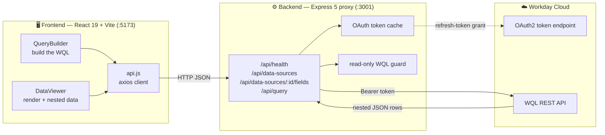
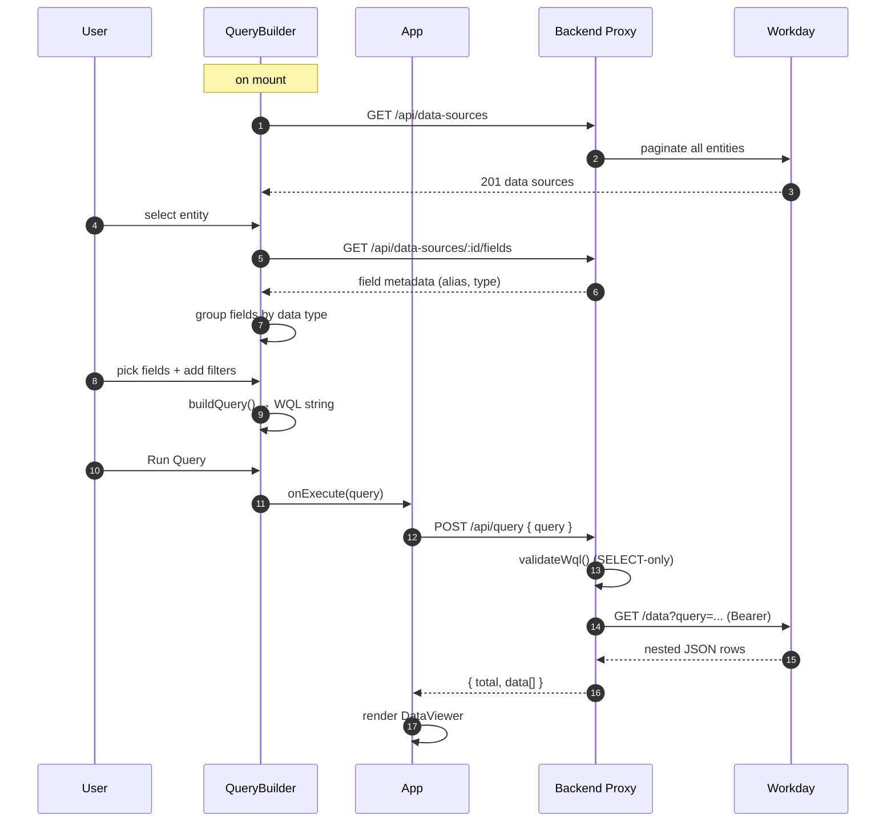

# Workday Explorer

> A visual **data viewer and query builder for Workday**. Pick an entity, select
> fields grouped by data type, add filters, run a **live WQL query** against a real
> Workday tenant, and explore the results — including expandable, per-column
> **nested / multi-instance** data.

---

## Table of Contents

- [What it does](#what-it-does)
- [Architecture](#architecture)
- [How it works (end to end)](#how-it-works-end-to-end)
- [Quick Start](#quick-start)
- [Repository Layout](#repository-layout)
- [Key Decisions](#key-decisions)
- [Documentation](#documentation)
- [Background](#background)
- [System Access (Workday)](#system-access-workday)

---

## What it does

Unlike SuccessFactors' clean OData endpoints, Workday has **no single easy query
API** — data access is fragmented across SOAP, a partial REST API, RaaS, and WQL,
and the data is deeply nested by default. This app makes that data approachable:

| Capability | Detail |
| --- | --- |
| 🔎 **Entity selection** | Searchable combobox over **all 201** WQL data sources |
| 🏷️ **Type-aware field picker** | Fields grouped by data type (Text, Numeric, Date, Boolean, Single/Multi-instance) with Select All / None |
| 🧮 **Smart filters** | Operators adapt to the field type (`contains` for text, `>`/`<` for numbers/dates) |
| 👁️ **Live WQL preview** | The generated `SELECT … FROM … WHERE …` updates as you build, with copy-to-clipboard |
| 📊 **Results table** | Sticky headers, humanized column names, real-time search |
| 🌳 **Nested data** | Expand a row to see nested objects/arrays **aligned under their column** |
| 📤 **Export** | CSV and PDF of the (filtered) result set |

---

## Architecture

A three-tier setup: a React SPA talks only to a local Express proxy, which holds
the Workday credentials and speaks WQL to the cloud.



**Why a proxy?** It keeps the OAuth secret and refresh token server-side, sidesteps
CORS, auto-paginates Workday's 20-per-page entity list into one response, and
enforces `SELECT`-only queries. See [`backend/README.md`](backend/README.md).

---

## How it works (end to end)



---

## Quick Start

> Requires **Node.js ≥ 18**. Run the backend first, then the frontend.

**1. Backend proxy** (port `3001`)

```bash
cd backend
npm install
cp .env.example .env    # then fill in your Workday credentials (see below)
npm run dev
```

You should see:

```
Backend proxy running on http://localhost:3001
Using Workday WQL root: https://impl-services1.<dc>.myworkday.com/api/wql/v1/your-tenant
```

The proxy reads all Workday config from `backend/.env` and **refuses to start** if
a required value is missing. The tokens you need:

| Variable | Secret | What it is |
| --- | :---: | --- |
| `WORKDAY_CLIENT_ID` | 🔐 | OAuth client id (refresh-token grant) |
| `WORKDAY_CLIENT_SECRET` | 🔐 | OAuth client secret |
| `WORKDAY_REFRESH_TOKEN` | 🔐 | Long-lived refresh token for your user/client |
| `WORKDAY_TENANT` | — | Tenant id (e.g. `your-tenant`) |
| `WORKDAY_BASE_URL` | — | Workday host (e.g. `https://impl-services1.<dc>.myworkday.com`) |
| `PORT` | — | Proxy port (optional, defaults to `3001`) |

> 🔐 The three secret values come from the Workday OAuth credentials (see
> [System Access](#system-access-workday)). `.env` is gitignored — never commit it.
> Only `.env.example` (a placeholder template) is checked in. The frontend has an
> optional `frontend/.env.example` too (just `VITE_API_BASE_URL`).

**2. Frontend** (port `5173`)

```bash
cd frontend
npm install
npm run dev
```

Open the URL Vite prints (default `http://localhost:5173`).

**3. Try a query** — the entity picker defaults to a verified, working data source.
Or build your own, e.g.:

```sql
SELECT cf_WorkerStatus, cf_Division, cf_FormattedCompany_Name
FROM allWorkers
WHERE cf_WorkerStatus = 'Active'
```

> 💡 **Entities with live data** (no prompts needed): `allWorkers` (1502 rows),
> `allActiveEmployees` (1065), `allPositions` (1753), `allJobProfiles` (163).
> Note WQL does **not** support `SELECT *` — always pick explicit fields.

---

## Repository Layout

```
workday-explorer/
├── README.md              # this file — project overview
├── SUBMISSION.md          # how to run + verified demo query
├── backend/
│   ├── server.js          # Express proxy: OAuth, routes, validation, pagination
│   └── README.md          # backend deep-dive (auth flow, API, security)
├── frontend/
│   ├── src/
│   │   ├── App.jsx        # shell + top-level state
│   │   ├── api.js         # axios client (4 endpoints)
│   │   └── components/
│   │       ├── QueryBuilder.jsx   # entity + fields + filters + WQL preview
│   │       └── DataViewer.jsx     # table + nested rendering + export
│   └── README.md          # frontend deep-dive (components, data flow, state)
└── docs/
    ├── approach.md        # required approach note (WQL/OAuth/nesting/next steps)
    └── WQL.pdf, RaaS Basic.pdf, EIB Doc.pdf
```

---

## Key Decisions

| Decision | Why |
| --- | --- |
| **WQL over RaaS/SOAP** | SQL-like, runs over REST, natively supports field selection, filtering, and nested/multi-instance data — maps directly to the challenge |
| **OAuth refresh-token (not Basic)** | Basic auth returned `401` from this environment; OAuth refresh flow successfully returns access tokens |
| **Backend proxy** | Keeps credentials off the browser, solves CORS, hides Workday's pagination |
| **Metadata-driven UI** | Sources and fields are discovered live from Workday, so the builder adapts to whatever the tenant exposes |
| **Recursive nested viewer** | Renders descriptors, flat arrays (chips), complex arrays (numbered), and objects (key-value) without dropping multi-instance data |

Full justification is in [`docs/approach.md`](docs/approach.md).

---

## Documentation

| Doc | Covers |
| --- | --- |
| [`frontend/README.md`](frontend/README.md) | Component tree, data flow, query-building, nested rendering, state management |
| [`backend/README.md`](backend/README.md) | OAuth flow, request lifecycle, API reference, pagination fix, security model |

---

## Background

### Workday Data Viewer and Query Builder

**Problem.** Workday has no single easy query API. Data access is fragmented across
SOAP web services, a partial REST API, Reports as a Service, and Workday Query
Language, each with different authentication and a different data shape. On top of
that, Workday's data is deeply nested — a single Worker carries employment,
position, and organization data several levels down. Building even a basic "pick an
entity, filter it, see the rows" viewer means first working out the right way to get
data out, then taming that nesting.

**Goals.** Build a data viewer and query builder where a user can:

1. **Select an entity** to work with (for example, Worker / employee).
2. **Add filter criteria** on that entity (for example, department = a value).
3. **Hit the Workday API** to extract the matching data.
4. **See the result in a table.**
5. **Handle nested data appropriately** — expandable nested rows, a nested
   sub-table, or controlled flattening. This is a core requirement.

**Out of scope:** PECI/WECI/EIB; writing data back to Workday; charts; supporting
every Workday entity; end-user auth/SSO; production deployment.

---

## System Access (Workday)

Point the app at your own Workday tenant. Replace `<your-tenant>` and `<dc>`
(your Workday data center, e.g. `wd2`, `wd5`, `wd12`) below with the values for
your environment.

- **Login URL:** `https://impl.<dc>.myworkday.com/<your-tenant>`
- **Tenant:** `<your-tenant>`
- **REST API base URL:** `https://impl-services1.<dc>.myworkday.com`
- **WQL endpoint:** `https://impl-services1.<dc>.myworkday.com/api/wql/v1/<your-tenant>`
- **Auth used by this app:** OAuth 2.0 refresh-token grant (handled by the backend proxy)

### OAuth Client Credentials

Use your own Workday OAuth credentials. Register an API client in your Workday
tenant (or get the values from your Workday administrator) and supply them
through `backend/.env` (copy from `backend/.env.example`) — they are **not**
stored in code or committed. Keep them private.

| `.env` variable | Description |
| --- | --- |
| `WORKDAY_CLIENT_ID` | OAuth client ID for your Workday API client |
| `WORKDAY_CLIENT_SECRET` | OAuth client secret for that client |
| `WORKDAY_REFRESH_TOKEN` | Long-lived refresh token for your user/client |

> If `/health` returns `invalid_client` or `invalid_grant`, the credentials are
> wrong or have expired/rotated — obtain fresh ones and update `backend/.env`
> (no code change needed).
