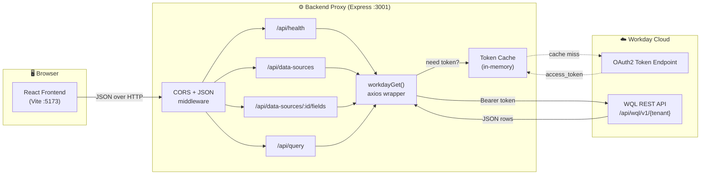
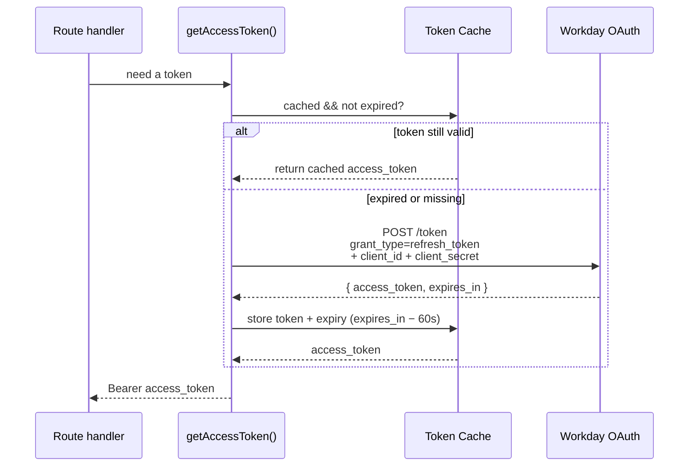
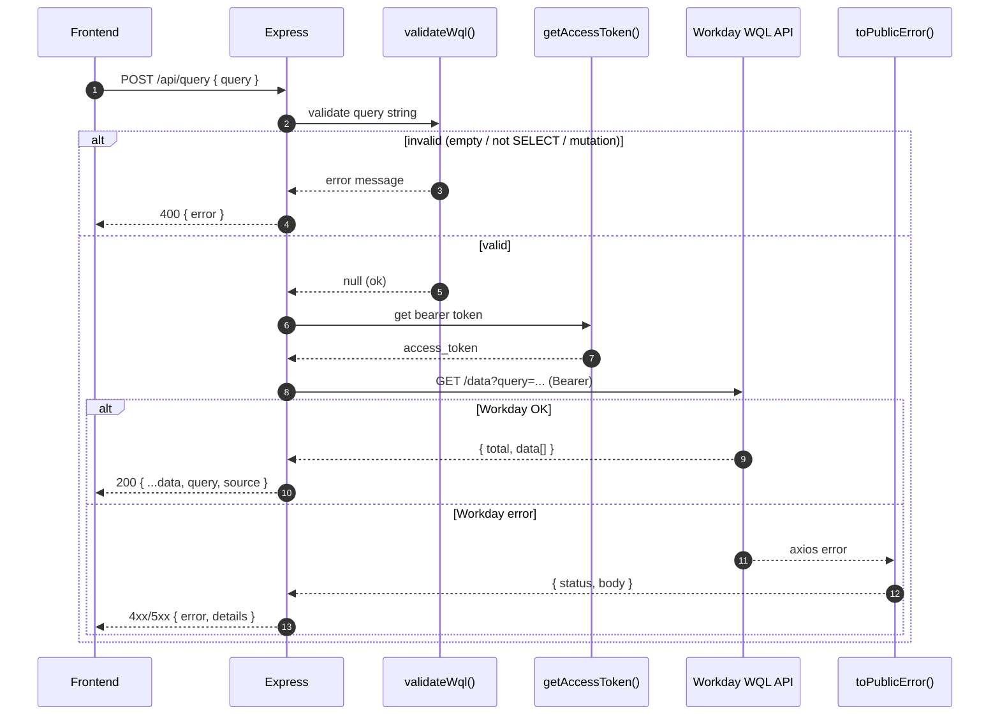
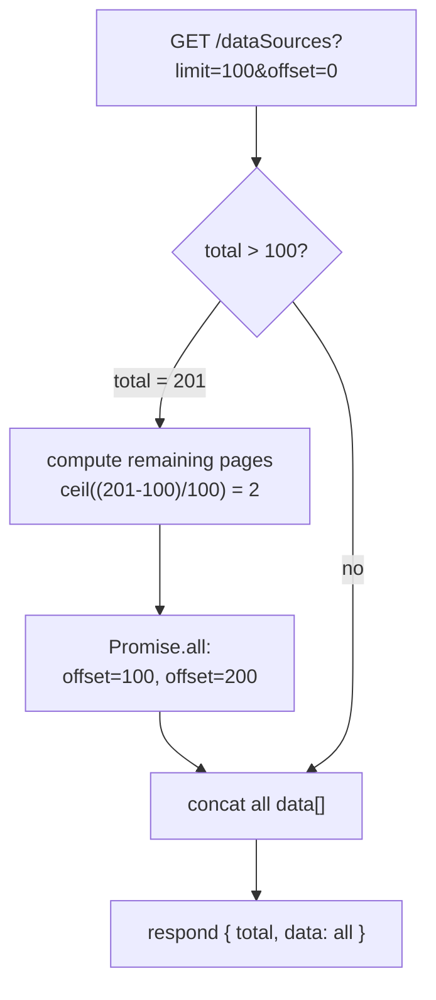
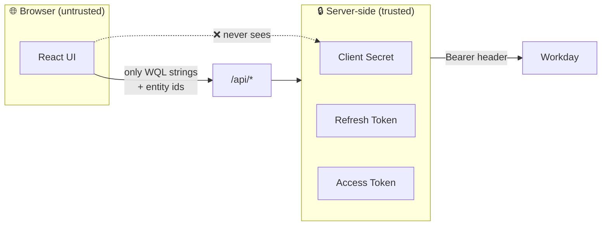

# Workday Explorer — Backend Proxy

> A thin, secure **Express 5** proxy that sits between the React frontend and the
> **Workday WQL REST API**. It handles OAuth token management, request validation,
> automatic pagination, and error normalization — so the browser never touches a
> Workday credential and never has to know how Workday paginates.

---

## Table of Contents

- [Why a backend at all?](#why-a-backend-at-all)
- [Tech Stack](#tech-stack)
- [Architecture](#architecture)
- [Authentication Flow (OAuth refresh-token)](#authentication-flow-oauth-refresh-token)
- [Request Lifecycle](#request-lifecycle)
- [API Reference](#api-reference)
- [The Pagination Problem (and fix)](#the-pagination-problem-and-fix)
- [Security Model](#security-model)
- [Configuration](#configuration)
- [Running Locally](#running-locally)
- [Project Layout](#project-layout)
- [Troubleshooting](#troubleshooting)

---

## Why a backend at all?

The frontend *could* call Workday directly — but it shouldn't, for three reasons:

| Concern | Without proxy | With this proxy |
| --- | --- | --- |
| **Credentials** | OAuth client secret + refresh token shipped to the browser ❌ | Secrets stay server-side ✅ |
| **CORS** | Workday does not send permissive CORS headers; browser calls fail ❌ | Server-to-server has no CORS ✅ |
| **Pagination** | Each entity list capped at 20 rows ❌ | Auto-merged into one response ✅ |
| **Safety** | Any WQL (incl. mutations) could be sent ❌ | `SELECT`-only guard ✅ |

---

## Tech Stack

| Layer | Choice | Version |
| --- | --- | --- |
| Runtime | Node.js | ≥ 18 |
| Web framework | Express | `^5.2.1` |
| HTTP client | axios | `^1.18.0` |
| CORS | cors | `^2.8.6` |
| Config | dotenv | `^17.4.2` |
| Auth | Workday OAuth 2.0 (refresh-token grant) | — |

There is **no database**. The backend is fully stateless except for an in-memory
access-token cache.

---

## Architecture



---

## Authentication Flow (OAuth refresh-token)

The backend never uses a username/password. It exchanges a long-lived **refresh
token** for short-lived **access tokens**, caching each access token until ~60s
before it expires.



**Why `expires_in − 60`?** A 60-second safety margin guarantees we never send a
token that expires mid-flight to Workday.

```js
// server.js — token caching
let accessToken = null;
let tokenExpiry = 0;

async function getAccessToken() {
  if (accessToken && Date.now() < tokenExpiry) return accessToken;   // cache hit
  // ...refresh-token exchange...
  tokenExpiry = Date.now() + Math.max(expiresIn - 60, 60) * 1000;     // safety margin
  return accessToken;
}
```

---

## Request Lifecycle

End-to-end path of a single `/api/query` call:



---

## API Reference

Base URL: `http://localhost:3001/api`

### `GET /health`

Confirms the proxy can reach Workday and mint a token.

```jsonc
// 200 OK
{
  "ok": true,
  "tenant": "your-tenant",
  "auth": "oauth_refresh_token",
  "wqlRoot": "https://impl-services1.<dc>.myworkday.com/api/wql/v1/your-tenant"
}
```

### `GET /data-sources`

Returns **all** queryable WQL data sources (entities). Transparently paginates —
see [The Pagination Problem](#the-pagination-problem-and-fix).

```jsonc
// 200 OK
{
  "total": 201,
  "data": [
    { "id": "abc...", "alias": "allWorkers", "descriptor": "All Workers" },
    { "id": "def...", "alias": "allPositions", "descriptor": "All Positions" }
    // ...all 201
  ]
}
```

### `GET /data-sources/:id/fields`

Returns the field metadata (alias, descriptor, data type) for one data source.
Powers the grouped, type-aware field picker in the UI.

```jsonc
// 200 OK
{
  "data": [
    { "alias": "cf_WorkerStatus", "descriptor": "Worker Status", "type": "Text" },
    { "alias": "cf_Division",     "descriptor": "Division",      "type": "Single instance" }
  ]
}
```

### `POST /query`

Runs a read-only WQL query.

```jsonc
// Request
{ "query": "SELECT cf_WorkerStatus, cf_Division FROM allWorkers WHERE cf_WorkerStatus = 'Active'" }

// 200 OK
{
  "total": 1065,
  "data": [ /* rows */ ],
  "query": "SELECT ...",     // echoed back
  "source": "workday_wql"    // provenance tag
}
```

| Status | Meaning |
| --- | --- |
| `400` | Query failed local validation (empty, not `SELECT`, or contains a mutation keyword) |
| `4xx` | Workday rejected the query (bad field, missing prompt, etc.) — see `details` |
| `500` | Token/connection failure |

---

## The Pagination Problem (and fix)

Workday's `/dataSources` endpoint returns **only 20 rows per page** but reports a
`total` of 201. The naive proxy showed users just the first 20 entities.

**Fix:** fetch page 1, read `total`, then fan out the remaining pages **in
parallel** and concatenate.



```js
// server.js
const PAGE = 100;
const first = await workdayGet('/dataSources', { limit: PAGE, offset: 0 });
const total = first.total ?? (first.data || []).length;
let all = [...(first.data || [])];

const remaining = Math.ceil((total - all.length) / PAGE);
const pages = Array.from({ length: remaining }, (_, i) =>
  workdayGet('/dataSources', { limit: PAGE, offset: (i + 1) * PAGE }),
);
(await Promise.all(pages)).forEach((p) => { all = all.concat(p.data || []); });

res.json({ total, data: all });
```

---

## Security Model



Two defensive layers:

1. **Credential isolation** — the OAuth secret and refresh token live **only** in
   `backend/.env` (gitignored), loaded into `process.env`. Nothing is hard-coded in
   `server.js`, and the browser only ever sends WQL strings and entity ids.
2. **Read-only guard** — `validateWql()` rejects anything that isn't a `SELECT`
   and blocks mutation keywords, so the proxy cannot be used to alter Workday data.

```js
function validateWql(query) {
  const value = String(query || '').trim();
  if (!value) return 'Query is required';
  if (!/^select\s+/i.test(value)) return 'Only SELECT WQL queries are allowed';
  if (/\b(insert|update|delete|drop|alter|create|truncate)\b/i.test(value))
    return 'Only read-only WQL queries are allowed';
  return null;
}
```

> ✅ **No secrets in code.** `server.js` reads every Workday value from the
> environment and **exits at boot** (with a list of what's missing) if any required
> variable is absent. `.env` is gitignored; only `.env.example` is committed.

---

## Configuration

All configuration is read from environment variables — **there are no hard-coded
fallbacks**. Copy the template and fill it in:

```bash
cp .env.example .env
```

### Tokens / variables you need

| Variable | Required | Secret | Purpose |
| --- | :---: | :---: | --- |
| `WORKDAY_CLIENT_ID` | ✅ | 🔐 | OAuth client id (refresh-token grant) |
| `WORKDAY_CLIENT_SECRET` | ✅ | 🔐 | OAuth client secret |
| `WORKDAY_REFRESH_TOKEN` | ✅ | 🔐 | Long-lived refresh token for your user/client |
| `WORKDAY_TENANT` | ✅ | — | Workday tenant id (e.g. `your-tenant`) |
| `WORKDAY_BASE_URL` | ✅ | — | Workday host (e.g. `https://impl-services1.<dc>.myworkday.com`) |
| `PORT` | — | — | Proxy port (defaults to `3001`) |

The three 🔐 secrets are obtained from the Workday API client. If you get
`invalid_client` or `invalid_grant` at `/health`, the
client credentials or refresh token have expired — drop in fresh values and
restart. No code change required.

`.env.example`:

```bash
PORT=3001
WORKDAY_TENANT=your_tenant_here
WORKDAY_BASE_URL=https://impl-services1.<dc>.myworkday.com
WORKDAY_CLIENT_ID=your_client_id_here
WORKDAY_CLIENT_SECRET=your_client_secret_here
WORKDAY_REFRESH_TOKEN=your_refresh_token_here
```

Derived at boot:

```
WQL_ROOT  = {BASE_URL}/api/wql/v1/{TENANT}
TOKEN_URL = {BASE_URL}/ccx/oauth2/{TENANT}/token
```

If a required variable is missing the proxy refuses to start:

```
Missing required environment variable(s): WORKDAY_CLIENT_SECRET
Copy backend/.env.example to backend/.env and fill in the values.
```

---

## Running Locally

```bash
cd backend
npm install
cp .env.example .env   # then fill in your Workday credentials
npm run dev            # = node server.js
```

On success:

```
Backend proxy running on http://localhost:3001
Using Workday WQL root: https://impl-services1.<dc>.myworkday.com/api/wql/v1/your-tenant
```

Smoke-test it:

```bash
# health
curl http://localhost:3001/api/health

# list entities (all 201)
curl http://localhost:3001/api/data-sources

# run a query
curl -X POST http://localhost:3001/api/query \
  -H "Content-Type: application/json" \
  -d '{"query":"SELECT cf_WorkerStatus, cf_Division FROM allWorkers"}'
```

---

## Project Layout

```
backend/
├── server.js          # entire proxy: auth, routes, validation, pagination
├── package.json       # express, axios, cors, dotenv
├── .env.example       # template for required environment variables
├── .env               # your real credentials (gitignored — never committed)
└── README.md          # this file
```

`server.js` at a glance:

| Section | Lines (approx) | Responsibility |
| --- | --- | --- |
| Config + constants | top | env vars, derived URLs |
| `toPublicError()` | — | normalize axios errors into `{ status, body }` |
| `getAccessToken()` | — | OAuth refresh + token cache |
| `workdayGet()` | — | authenticated GET helper |
| `validateWql()` | — | read-only query guard |
| Routes | bottom | `/health`, `/data-sources`, `/data-sources/:id/fields`, `/query` |

---

## Troubleshooting

| Symptom | Likely cause | Fix |
| --- | --- | --- |
| `Missing required environment variable(s): …` at boot | No `.env` or incomplete | `cp .env.example .env` and fill in values |
| `EADDRINUSE :::3001` | Proxy already running | `pkill -f "node server.js"` then restart |
| `/health` shows `invalid_client` / `invalid_grant` | OAuth client creds or refresh token expired/revoked | Put fresh credentials in `.env`, restart |
| `/health` returns `ok: false` | Token refresh failed | Check client id/secret/refresh token in `.env` |
| Query returns `Enter a valid report field. This field is invalid: *.` | `SELECT *` not supported by WQL | Select explicit fields |
| Query returns `Parms are required...` | Data source needs a prompt/filter | Pick a different entity or add the required filter |
| Only 20 entities show | Old un-paginated build | Pull latest `server.js` |
