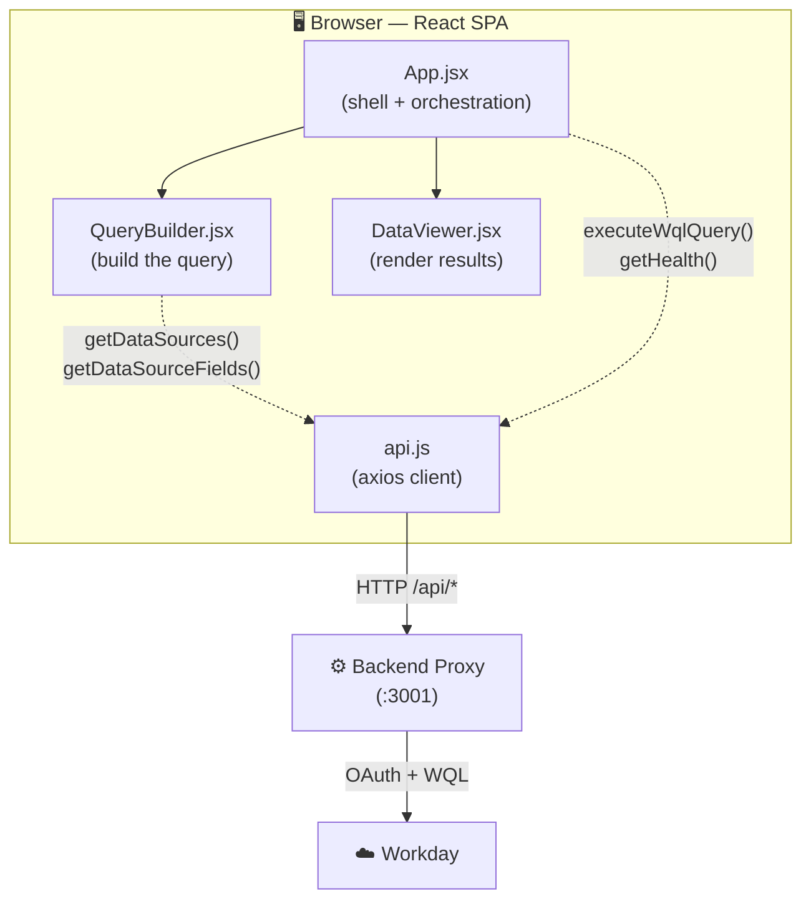
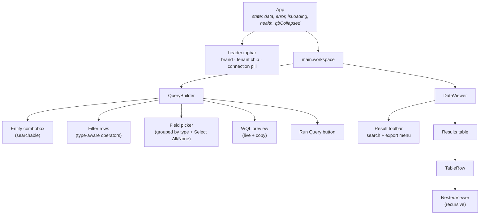
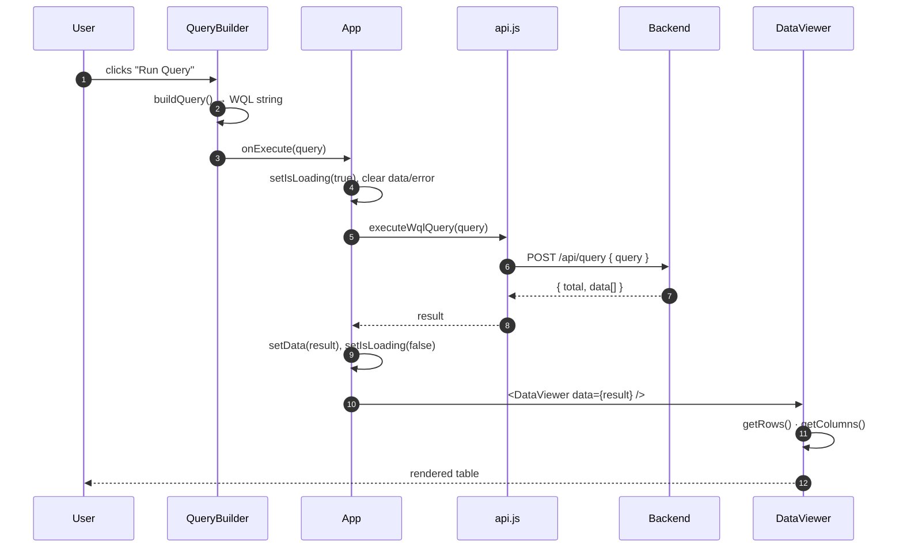
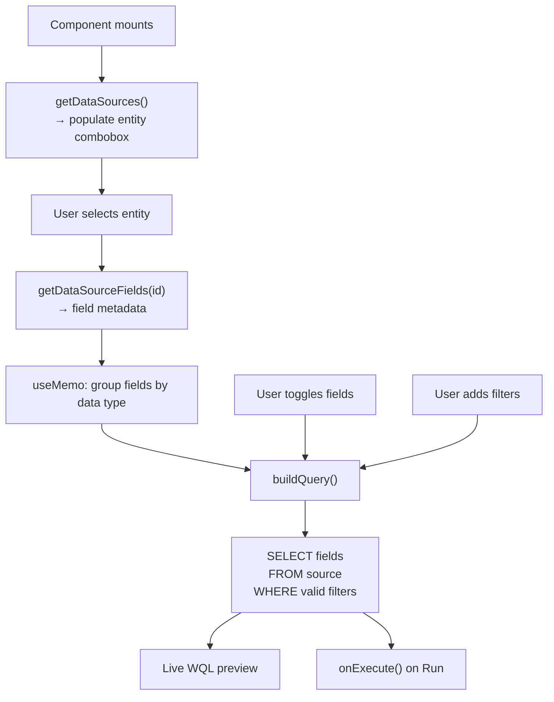
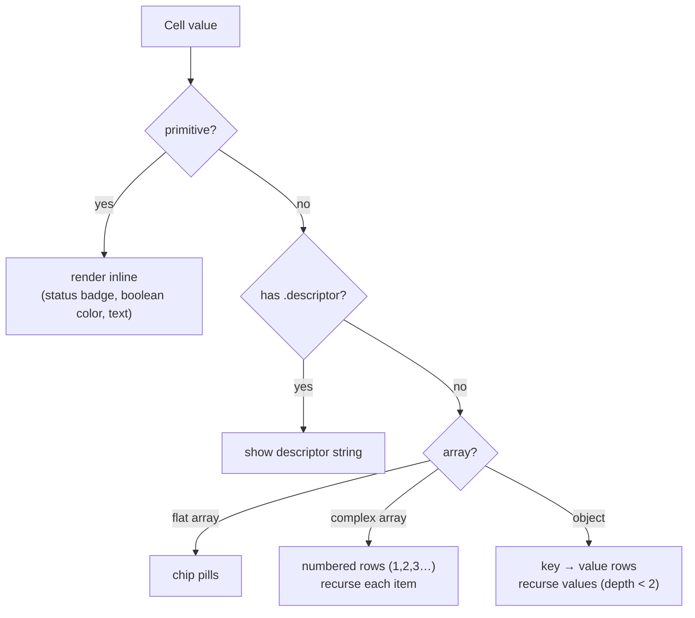
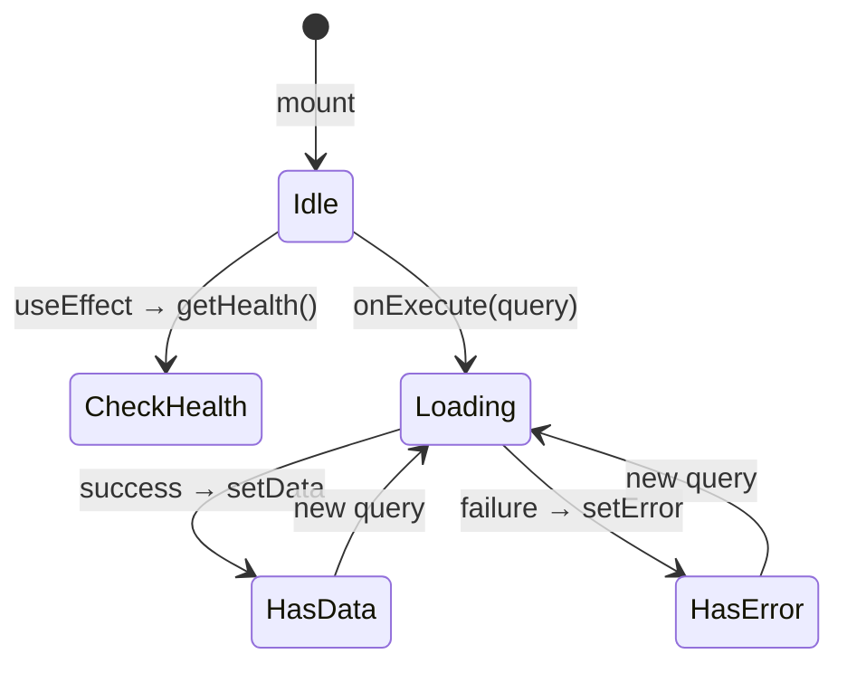

# Workday Explorer — Frontend

> A **React 19 + Vite** single-page app for visually building **Workday Query
> Language (WQL)** queries and exploring deeply nested Workday data. Pick an
> entity, select fields grouped by data type, add filters, run a live query, and
> browse the results — including expandable, per-column **nested / multi-instance**
> data.

---

## Table of Contents

- [Feature Tour](#feature-tour)
- [Tech Stack](#tech-stack)
- [Application Architecture](#application-architecture)
- [Component Tree](#component-tree)
- [Data Flow](#data-flow)
- [Query-Building Flow](#query-building-flow)
- [Nested Data Rendering](#nested-data-rendering)
- [State Management](#state-management)
- [API Layer](#api-layer)
- [Styling System](#styling-system)
- [Running Locally](#running-locally)
- [Project Layout](#project-layout)

---

## Feature Tour

| Feature | Where | What it does |
| --- | --- | --- |
| **Searchable entity picker** | QueryBuilder | Combobox over all 201 WQL data sources, filterable by name *and* alias |
| **Type-grouped field picker** | QueryBuilder | Fields grouped by data type (Text, Numeric, Date, Boolean, Single/Multi-instance) with colored badges |
| **Select All / None** | QueryBuilder | One-click bulk field selection |
| **Type-aware filters** | QueryBuilder | Operators adapt to field type (`contains` for text, `>`/`<` for numbers/dates) |
| **Live WQL preview** | QueryBuilder | The generated `SELECT … FROM … WHERE …` updates as you build, with copy-to-clipboard |
| **Collapsible builder** | App | Collapse the builder to a strip to maximize the results table |
| **Results search** | DataViewer | Real-time client-side search across every column |
| **Per-column nested expansion** | DataViewer | Expand a row to see nested objects/arrays *directly under their column* |
| **CSV + PDF export** | DataViewer | Export the (filtered) result set |
| **Humanized headers** | DataViewer | `cf_WorkerStatus` → `Worker Status` |

---

## Tech Stack

| Concern | Choice | Version |
| --- | --- | --- |
| UI library | React | `^19.2.6` |
| Build tool | Vite | `^8.0.12` |
| HTTP client | axios | `^1.18.0` |
| Icons | lucide-react | `^1.21.0` |
| PDF export | jspdf + jspdf-autotable | `^4.2.1` / `^5.0.8` |
| Linting | ESLint (flat config) | `^10.3.0` |
| Styling | Hand-written CSS + custom properties | — |

No CSS framework, no state library, no router — it's a deliberately lean single page.

---

## Application Architecture



**Separation of concerns**

- **`App.jsx`** owns the top-level state (the result `data`, `error`, `isLoading`,
  `health`, and whether the builder is collapsed) and wires the two panels together.
- **`QueryBuilder.jsx`** is responsible for *constructing* a valid WQL string. It
  fetches its own metadata (sources + fields) and calls `onExecute(query)` upward.
- **`DataViewer.jsx`** is a pure presentation component — it receives `data` /
  `error` and renders the table, nested cells, search, and exports.

---

## Component Tree



---

## Data Flow

How a result travels from a click to the screen:



On failure, `App` stores the error instead and `DataViewer` renders a friendly
error panel (with a `<details>` block for the raw Workday response).

---

## Query-Building Flow

The QueryBuilder transforms UI state into a WQL string entirely client-side:



**`buildQuery()` logic**

```js
const fields = selectedFields.length
  ? selectedFields.join(', ')
  : allFieldValues.join(', ') || '*';

let query = `SELECT ${fields} FROM ${source}`;

const validFilters = filters.filter(
  (f) => filterOptions.some((o) => o.value === f.field) && f.field && f.operator && String(f.value).trim(),
);
if (validFilters.length) {
  query += ` WHERE ${validFilters.map((f) => `${f.field} ${f.operator} ${quoteValue(f.value)}`).join(' AND ')}`;
}
```

**Type-aware operators** — the operator dropdown adapts to the selected field's type:

| Field type | Operators offered |
| --- | --- |
| Text | `=`, `!=`, `contains` |
| Boolean | `=`, `!=` |
| Numeric | `=`, `!=`, `>`, `<`, `>=`, `<=` |
| Date | `=`, `!=`, `>`, `<`, `>=`, `<=` |

`quoteValue()` auto-quotes strings but leaves numbers/booleans/`null` bare.

---

## Nested Data Rendering

Workday data is nested by default — a Worker carries location, org, and
multi-instance fields several levels deep. The viewer handles every shape:



**Per-column expansion.** When a row is expanded, the nested content for each
complex column appears in a second table row, **aligned under the column it
belongs to** — not in a single full-width blob:

```
┌──┬──────────────┬──────────────┬─────────────────┐
│▾ │ Worker Status│ Division     │ Benefits Partner│   ← data row
├──┼──────────────┼──────────────┼─────────────────┤
│  │              │              │ BENEFITS PARTNER│   ← nested row
│  │              │              │ • Maria Cardoza │     (aligned under column)
└──┴──────────────┴──────────────┴─────────────────┘
```

`NestedViewer` is recursive with a depth guard (`depth < 2`) to keep extremely
deep structures from blowing up the layout while never *dropping* data.

---

## State Management

All state is local React state — no Redux/Zustand. Two stateful components:

### `App.jsx`



| State | Type | Role |
| --- | --- | --- |
| `data` | object \| null | Latest query result |
| `error` | object \| null | Latest error |
| `isLoading` | bool | Disables Run + shows spinner |
| `health` | `{ ok, tenant }` | Connection pill in topbar |
| `qbCollapsed` | bool | Builder collapsed ↔ expanded |

### `QueryBuilder.jsx`

Key state: `sources`, `fieldsMeta`, `source`, `selectedFields`, `filters`, plus UI
toggles (`advancedOpen`, `wqlOpen`, `sourceOpen`, `sourceSearch`). Derived values
use `useMemo`:

| Memo | Derives |
| --- | --- |
| `fieldOptions` | `{ value, label, type }` per field |
| `filterOptions` | only filterable fields |
| `allFieldValues` | every field alias (for Select All) |
| `fieldsByType` | fields grouped + ordered by data type |
| `filteredSources` | entity list filtered by search box |

> **Mount stability:** the QueryBuilder stays mounted when collapsed (it renders a
> strip instead of unmounting), so all loaded metadata and selections survive a
> collapse/expand — no refetch, no flicker.

---

## API Layer

`src/api.js` is a thin axios wrapper. Base URL is configurable via
`VITE_API_BASE_URL` (defaults to `http://localhost:3001/api`).

```js
const client = axios.create({
  baseURL: import.meta.env.VITE_API_BASE_URL || 'http://localhost:3001/api',
  timeout: 45000,
});
```

| Function | Method | Endpoint |
| --- | --- | --- |
| `getHealth()` | GET | `/health` |
| `getDataSources()` | GET | `/data-sources` |
| `getDataSourceFields(id)` | GET | `/data-sources/:id/fields` |
| `executeWqlQuery(query)` | POST | `/query` |

Every call funnels errors through `unwrapError()` so components receive a
consistent `{ error, details }` shape regardless of network vs. server failure.

---

## Styling System

A single `src/index.css` defines a light, card-based theme via CSS custom
properties (design tokens) — colors, borders, radii, shadows, transitions. No
build-time CSS tooling beyond Vite.

Layout highlights:

- **`.app-shell`** — full-height flex column (topbar + workspace)
- **`.workspace`** — CSS grid `440px | 1fr`, collapses to `48px | 1fr`
- **Panels** — floating cards (`border-radius` + `box-shadow`) on a slate background
- **QueryBuilder** — pinned header/footer with an independently scrollable body
- **Results table** — `table-layout: auto`, ellipsis-truncated cells with `title`
  tooltips, sticky header, vertical column dividers

---

## Running Locally

> Requires the [backend proxy](../backend/README.md) running on `:3001` first.

```bash
cd frontend
npm install
npm run dev          # Vite dev server (HMR)
```

Open the URL Vite prints (default `http://localhost:5173`).

| Script | Does |
| --- | --- |
| `npm run dev` | Start dev server with hot-module reload |
| `npm run build` | Production build → `dist/` |
| `npm run preview` | Preview the production build |
| `npm run lint` | Run ESLint |

Optional `.env` for a non-default backend:

```bash
VITE_API_BASE_URL=http://localhost:3001/api
```

---

## Project Layout

```
frontend/
├── index.html               # app entry, meta tags
├── vite.config.js           # Vite + React plugin
├── eslint.config.js         # flat ESLint config
├── package.json
└── src/
    ├── main.jsx             # React root mount
    ├── App.jsx              # shell, top-level state, orchestration
    ├── api.js               # axios client (4 endpoints)
    ├── index.css            # full theme + layout (design tokens)
    ├── App.css              # legacy template styles
    └── components/
        ├── QueryBuilder.jsx # entity + fields + filters + WQL preview
        └── DataViewer.jsx   # table + nested rendering + search + export
```
